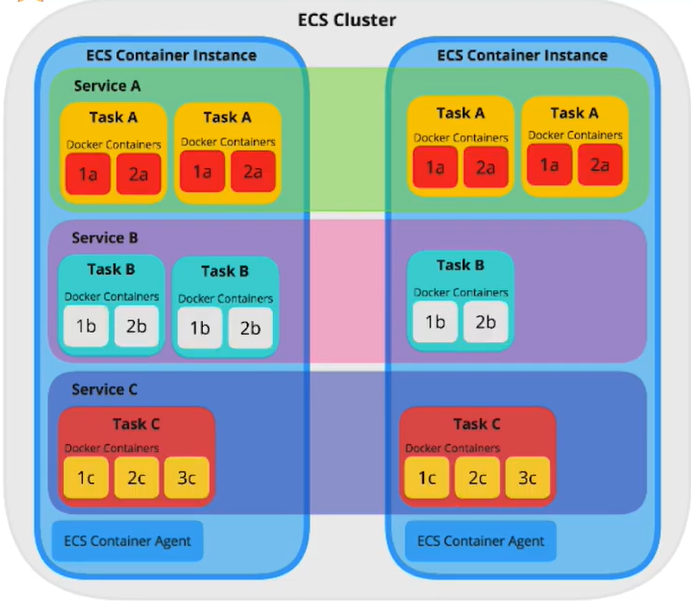
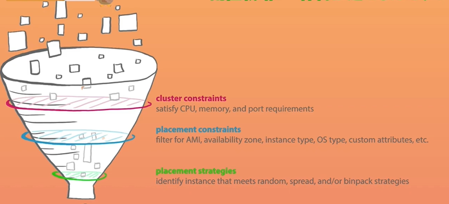

# ECS
### Resource/Config
```
Resource
 - Cluster
 - Task Definition
-----------------------------------------------------------
<Cluster>                         <Task Definition>
 - Service: role                   - set Containers config
 - Task: Containers                 - Revision: Version
 - ECS Instance: fagate or EC2
 - Metric: CPU/Memory etc...
 - Task Schedule
 - Tags
 - Capacity Providor
-----------------------------------------------------------
 
Config
 - Service
 - Task Definition  ※1:1
-----------------------------------------------------------
<Cluster/Service>                 <Task Definition>
 # Placement Design                # Task Design
 - Task                            - Task CPU/Memory
 - ELB                               ★ Container Definition
 - Auto Scaling                        - Image (DockerHub/ECR)
 - etc...                              - IAM/Port/Log/etc...
-----------------------------------------------------------


<Container Defninition>
defined  => <Task Definition>
selected => <Service>
create   => <Cluster>
```



### Network
```
Client -> ELB -> Service

<Bridge Network Mode>
 - Local/Dockerfile
     - EXPOSE 80
 - ECS/Task Defefinition/Container Definition
     - Host      port: 0  -> Ephemeral port (30000~ Tmp/Random)
     - Container port: 80 ≓  docker run ... -p 80:80
 - EC2/Security Group
     - ELB Security Group Allow (0-65535 All-port）
-----------------------------------------------------------
                            ELB
                             ↓
     ┌─────────────────────────────────────────────┐
     |                  Target Group               |
     └─────────────────────────────────────────────┘
      ↓ 32798       ↓ 32799         ↓ 32798       ↓ 32799 (Ephemeral port)
┌EC2──────────┬─────────────┐ ┌EC2──────────┬─────────────┐ 
|     ↓ 80    |     ↓ 80    | |     ↓ 80    |     ↓ 80    |
|    task     |    task     | |    task     |    task     |
| container*2 | container*3 | | container*2 | container*3 |
└─────────────┴─────────────┘ └─────────────┴─────────────┘
```

### Storage Mount
```
<volumes>
 # docker manage
 - Dockerfile/VOLUME: Container path
   => /var/lib/docker/volumes/hash.../_data/

<bind mount>
# host manage
$ docker container run --name ... -d -p 80:80 -v $(pwd):<container path> <image name>:latest
```

### Instance
```
・Installed
  Docker deamon/Container Agent

<EC2>
 ※1. Design each scaling plan. EC2_Scale/Container_Scale
 ※2. Manage     Scale/Service (check => CAS (Capacity Provider))
 ※3. Consider the timing of server stop

<Fagate>
 ※1. Temporary local volume limit 20GB (Ver.1.4)  ※Ver.~1.3 4GB+10GB
 ※2. 20% more expensive than EC2 (check => Fagate stop)
 ※3. require awsVpcMode awsLogs
```

### IAM Role
```
<ecsInstanceRole>
・Conatiner AgentがAWSサービスAPIを使用するため
  /ECS/ECR/CloudWatch/...
```

### Update
```
<Develop>
 V1 -> V2

<ECR>
 V1 -> V2

<ECS/Task Definition>
 Conatainer Image URI V1 -> V2
 Task Definition/Revision No. V1 -> V2

<ECS/Cluster/Service>
 Revision V1 -> V2
```

### Auto Scaling
1. Scale Fagate
2. Scale EC2 & Container managed by myself
3. Scale EC2 & Container managed by Cluster Auto Scaling

```
-----------------------------------------------------------
2. Scale EC2 & Container managed by myself
-----------------------------------------------------------
   Limit: CPU/Memory     Service Sum
   task : min/max/desire capacity

ex) ＜ECS>
    min 4/max 10
    512MB/task -> 4/EC2
                    ↑
    <EC2>           |
    min 2/max 3     |
    t3.micro -> 2GB(2048MB) memory

    <Scaling Policy>
    Q.  EC2(2task) + EC2(2task) -> EC2(3task) + EC2(3task) -> Hope to boot EC2
    A.  Custom Metric/MemoryReservation/Service Sum Memory limit75% => EC2 Boot!!

-----------------------------------------------------------
3. Scale EC2 & Container managed by Cluster Auto Scaling
-----------------------------------------------------------
```

### Task Definition
```
<Set Container Config>
 - image/cpu/memory/port/volume/network/iam

<Task Role>
・between Service ex)RDS Connection

<Network Mode>
 - default/bridge/host/awsvpc/none
 - awsvpc
   - ENI can be attached each task, not only EC2
   - Each task could set open port & security group
   - Every task could set same port, deffer security group
   - VPC flow Logs could monitor each ENI (each task)
   - ELB target could registor each ENI
   ※ENI number depends on Instance type (t3.small:3, t2.micro 2) 

<Task Excecution Role>
/ecsTaskExecutionRole/...
・pull from ECR
```

### Container Definition
```
<Container Definition>
 - Corresponds to docker command

<Standard>
 - Image       : --image
 - Memory limit: --memory , --memory-reservation
   - Hard limit: Container process ends when the limit is exceeded
   - Soft limit: Secure memory in the container. Can be used beyond
 - Port mapping: -p , --publish

<Health check>
 - Health check: --health-cmd , --health-interval , --health-retries (default 3times)

<Environment>
 - CPU unit   : --cpus
 - Entry point: Value defined in Dockerfile can be overwritten
 - Command    : 〃
 - Work Dir   : 〃
 - env        : 〃 -e , --env

<Container time out>
 - Container time out: 
   - Define dependencies
   - Boot order
   - Control the stop order

<Network environment>
 - Link: --link  ※However not recommended
 - Host: --hostname
 - DNS : --dns

<Storage & Log>
 - Volume source : -volumes-from ※volume container
 - Log config    : Log is output to cloudWatchLogs by specifying aws logs
                   Chekking Auto configure & Cloud Watch logs will automatically add log group, region, and streams

<Security>
 - Privilege grant: Whether to give root authority
 - User           : Specify the user to be specified in the container

<Resource limits>
 - ulimit: --ulimit Limit the number of file descriptors. 
linux features
```

Constraint


```
Pass 3 filters

<cluster constraints>
 - Basic confirmation

<placement constraints>
- You can also specify a specific EC2 in your placement strategy
  ex) attribute:ecs.instance-type == t2.small
      attribute:ecs.availability-zone in [us-east-1a,   us-east1b]
      attribute:ecs.instance-type =~ g2.* attribunte:ecs.  availability-zone != us-east-1d
      # Reference: https://docs.aws.amazon.com/ja_jp/AmazonECS/  latest/developerguide/cluster-query-language.html

<placement strategles>
```

# Reference
Cluster Auto Scaling (Capacity Provider Reservation)
 https://aws.amazon.com/jp/blogs/news/aws-ecs-cluster-auto-scaling-is-now-generally-available/
https://dev.classmethod.jp/articles/aws-ecs-cluster-auto-scaling/

※Capacity Provider(CP)は削除できない？
https://buildersbox.corp-sansan.com/entry/2020/01/28/110000

Task Definition
https://docs.aws.amazon.com/ja_jp/AmazonECS/latest/developerguide/task_definition_parameters.html

Container Definition
https://docs.aws.amazon.com/ja_jp/AmazonECS/latest/developerguide/task_definition_parameters.html#standard_container_definition_params