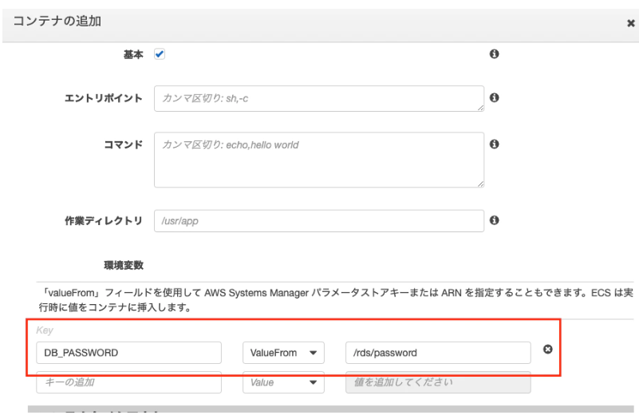

# System Manager

## Parameter Store
### 基本
- CLI
```sh
# put
$ aws ssm put-parameter --name 'plain_name' --value 'plain value' --type String

# put(edit)
$ aws ssm put-parameter --name 'plain_name' --value 'modified value' --overwrite --type String


# get
$ aws ssm get-parameter --output text --name 'plain_name' --query Parameter.Value
  plain value

------------------------------------------------------------
# put                         　# get
平文　: --type String           平文  : -
暗号化: --type SecureString     復号化: --with-decryption
```
- Terraform
```sh
# put
resource "aws_ssm_parameter" "vpc_id" {
    name  = "/staging/vpc/id"
    value = aws_vpc.staging.id
    type  = "String"
}
```
```sh
# get
data "aws_ssm_parameter" "vpc_id" {
    name  = "/staging/vpc/id" 
}
# use
resource "aws_security_group" "server" {
    vpc_id = data.aws_ssm_parameter.vpc_id.value
}
```


### SSH key
#### put SSH key to SSM
```sh
$ PRIVATE_KEY=$(cat ~/.ssh/id_rsa)
$ aws ssm put-parameter --name my_ssh_private_key --value "$PRIVATE_KEY" --type SecureString
```

#### attach IAM role to EC2
```sh
{
    "Version": "2012-10-17",
    "Statement": [
        {
            "Effect": "Allow",
            "Action": [
                "ssm:GetParameter"
            ],
            "Resource": "arn:aws:ssm:<region>:<account-id>:parameter/my_ssh_private_key"
        }
    ]
}
```

#### set SSH key to EC2
```sh
$ aws ssm get-parameter --name my_ssh_private_key --query Parameter.Value --with-decryption --output text > /root/.ssh/id_rsa
$ chmod 600 /root/.ssh/id_rsa
```
----
### RDS Password way1
https://qiita.com/Canon11/items/914e3b7bc538978f8a6a

#### Terraform template
```sh
# rds.tf

# パスワードをランダムで生成する。初回実行時の1度だけ生成。
resource "random_password" "password" {
  length           = 16
  special          = true
  override_special = "_%@"
}

resource "aws_rds_cluster" "main" {
  ...              # ランダムで生成したパスワードを設定
  master_password  = random_password.password.result
}
```
```sh
# parameter_store.tf

resource "aws_ssm_parameter" "rds_password" {
  name             = "/rds/password"
  type             = "SecureString" # KMSで暗号化して保存
  key_id           = xxxxxx # 暗号化に使う KMS key のID
  value            = aws_rds_cluster.main.master_password # RDSリソースのパスワードを参照
}
```
#### used by Fagate
##### コンソール上で環境変数にセット


#### use by EC2
##### CLIでパスワードを取得、環境変数にセット
```sh
# パラメータストアから/rds/passwordの値を復号化して読み込む。jsonで返ってくるので、値部分を抜き出し、環境変数にセットする。
$ DB_PASSWORD=$(aws ssm get-parameters --names /rds/password --with-decryption | jq '.Parameters[0].Value') 
```

### RDS Password way2
#### Terraform
```sh
# rds.tf

# var
locals {
    db_username    = "myk"
}

# Username register parameter_store [not_enctypt]
resource aws_ssm_parameter db_username {
  description      = "データベースのユーザー名"
  name             = "/rds/db_username"
  type             = "String"
  value            = local.db_username
}


# Ramdom Password [16 characters] 1度だけ
resource "random_password" "db_password" {
  length           = 16
  special          = true
  override_special = "!#()-[]"    # "_%@"
}

# Password register parameter_store [encrypt]
resource "aws_ssm_parameter" "db_password" {
  description      = "データベースのパスワード"
  name             = "/rds/db_password"
  type             = "SecureString"
  value            = ramdom_password.db_password.result
}


# Set db_password[encrypted] to RDS
resource aws_db_instance this {
  depends_on = [
    aws_security_group.db        , aws_db_subnet_group.this,
    aws_ssm_parameter.db_username, aws_ssm_parameter.db_password,
  ]
  ...
  username         = aws_ssm_parameter.db_username.value
  password         = aws_ssm_parameter.db_password.value   # ramdom_password.db_password.result
```


# その他の参考
- kms
https://khigashigashi.hatenablog.com/entry/2018/08/28/214417
